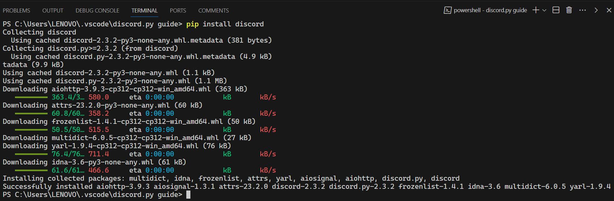

# Welcome to Discord.py Guide!

## This guide will cover all the basic things you need to learn to get started with making discord bots using the discord.py library

### Part I:- Configuring the basic settings for starting a discord bot

```python
# importing the necessary modules

import discord
from discord.ext import commands
```

These modules can be installed directly by running the following command in **Command Prompt / Terminal**( Depending on what OS you're currently using ).

```
pip install discord.py
```

If the installation was successful, It should look something like this:



Once this is done, we can start with writing some code to create our first ever discord bot written in python!

```python
# importing the necessary modules

import discord
from discord.ext import commands

# Enabling all the intents for our discord bot

intents = discord.Intents.all()

# Creating an instance of the Bot class and setting up the command prefix

bot = commands.Bot(command_prefix = "!", intents = intents)
```

**Intents** are a way to specify **what events the bot should receive from Discord**. `intents = discord.Intents.all()` indicates that the bot should receive all intents, allowing it to access all types of events.

`command_prefix = "!"` specifies the prefix that the bot will use to **recognize commands**. Feel free to change it to whatever you feel like!

- Note: The `command_prefix` parameter also accepts an **array of prefixes seperated by commas**. This way, you can have multiple prefixes for your discord bot.

For example,
```python
bot = commands.Bot(command_prefix = ["?", "!", ".", ",", "~",... so on], intents = intents)
```

Also, you can use the word `client` instead of `bot`. For this guide, I will be using the word `bot` since it's much shorter.

#### Now, let's write a code that runs when our bot goes online!

To do this, we will use a **decorator** along with a discord.py's pre-defined **asynchronous function** called ``on_ready``

```python
# importing the necessary modules

import discord
from discord.ext import commands

# Enabling all the intents for our discord bot

intents = discord.Intents.all()

# Creating an instance of the Bot class and setting up the command prefix

bot = commands.Bot(command_prefix = "!", intents = intents)

# Configuring an event that the bot will listen to when it comes online

@bot.event
async def on_ready():
    print(f"Logged in as {bot.user}")
```

### Now what the hell are decorators?

**Decorators** are a powerful feature that allows you to **modify or extend the behaviour of functions or methods without changing their actual code**. Decorators are implemented using the `@decorator_name` syntax followed by the function or method you want to decorate( or modify in layman's terms ).

In the above code snippet, the decorator is the `@bot.event` and the function which is being decorated or modified is the `on_ready` function.

If you wish to learn more about decorators in python, you can click on this link -> [Python Decorators](https://book.pythontips.com/en/latest/decorators.html).

### And what about `async` and `await`?

`async` and `await` are features in Python for writing asynchronous code, typically used in conjunction with the `asyncio` library. Asynchronous programming allows us to write code that can **perform multiple tasks concurrently, without blocking the execution of other code**.

We want our bot to respond to **multiple users using the command at the same time**, and we don't want to delay a command execution just because someone else used a different command before!

Here's a basic example:

```python
import asyncio

async def greet():
    print("Hello")
    await asyncio.sleep(1)
    print("World")

async def main():
    await greet()

asyncio.run(main())
```

In the above example, `asyncio.sleep(1)` is an asynchronous operation that pauses the execution for **1 second without blocking the other tasks**. The `await` keyword is used to **wait for this operation to complete** before continuing with the execution.

To know more about asynchronous operations, you can click on this link -> [Async / Await](https://superfastpython.com/async-await-python/#:~:text=Generally%2C%20%E2%80%9Casync%E2%80%9D%20defines%20a,Swift%2C%20Rust%2C%20and%20Python.)

### Now let's get back to the code we were writing for starting our discord bot

```python
# importing the necessary modules

import discord
from discord.ext import commands

# Enabling all the intents for our discord bot

intents = discord.Intents.all()

# Creating an instance of the Bot class and setting up the command prefix

bot = commands.Bot(command_prefix = "!", intents = intents)

# Configuring an event that the bot will listen to when it comes online

@bot.event
async def on_ready():
    print(f"Logged in as {bot.user}")

# Running the bot using the bot.run() method

bot.run("INSERT YOUR BOT TOKEN HERE")
```

Now it's just that you have to insert a line at the end of your code, which is `bot.run()`. This takes in **bot token** in string( str ) format.

### CAUTION⚠️

A bot token is a **long string of characters** that looks similar to the image attached below this message.

 

 It's crucial to keep your bot token **secret and never share it publicly, as anyone with access to the token can control your bot**. If your token is compromised, you should regenerate it immediately through the [Discord Developer Portal](https://discord.com/developers/docs/intro) by clicking on the `Reset Token` button!

 I am able to confidently share my discord bot's token because I will be able to reset it before I publish this info on GitHub!

 ### Now let's get back to making our discord bot

 ```python
# importing the necessary modules

import discord
from discord.ext import commands

# Enabling all the intents for our discord bot

intents = discord.Intents.all()

# Creating an instance of the Bot class and setting up the command prefix

bot = commands.Bot(command_prefix = "!", intents = intents)

# Configuring an event that the bot will listen to when it comes online

@bot.event
async def on_ready():
    print(f"Logged in as {bot.user}")

# Running the bot using the bot.run() method

bot.run("INSERT YOUR BOT TOKEN HERE")
```

Don't worry, I have not changed anything.

We just have to run this code and the terminal should display a message saying that our bot is now online!

This is how it should look like if everything is setup correctly


As we can see in the above image, the bot **logged in successfully and is now online!**


But the bot doesn't do anything as of now, **because we haven't created any commands for our bot.**

So let's make a really basic command for our discord bot which when used, will **greet the user who ran the command!**

This will be the **last topic for our part 1 of this discord.py bot tutorial!**

```python
# importing the necessary modules

import discord
from discord.ext import commands

# Enabling all the intents for our discord bot

intents = discord.Intents.all()

# Creating an instance of the Bot class and setting up the command prefix

bot = commands.Bot(command_prefix = "!", intents = intents)

# Configuring an event that the bot will listen to when it comes online

@bot.event
async def on_ready():
    print(f"Logged in as {bot.user}")

# Configuring a command that the bot will respond to when a user uses that particular command

@bot.command(aliases = ["HELLO", "Hello",... so on])
async def hello(ctx):
    await ctx.send(f"Hello {ctx.author.mention}!")

# Running the bot using the bot.run() method

bot.run("INSERT YOUR BOT TOKEN HERE")
```

For making commands, we use the `@bot.command()` decorator which takes `aliases` as input. `aliases` can be a **single string of word** or **multiple words in an array seperated by commas** as shown in the above code snippet.

Then we define the `async function` which is named as `hello` in this example. It is to be noted that the **function name should always be same as the command name** so it is advised to name it properly. This async function takes `ctx` as input.

### Now what's ctx?

`ctx` stands for **context**( An instance of the `Context` class in discord.py ) and it represents the context in which a command is being invoked. **It contains information about the message, the channel, the author, and other relevant data**, allowing us to interact with the Discord API and respond appropriately to the command.

It is to be noted that `ctx` name is **purely just a naming convention** which is often used by developers a lot. It is **up to you** and the developer to decide what the name should actually be. For example, you can also name `ctx` as `context` if you like that more! However, throughout this entire guide, I will be using the same naming convention as other developers use.. which is `ctx`.

### `ctx` has a whole bunch of attributes. I have mentioned the most important and frequently used ones below!

- `ctx.author.id`: This returns an **integer representing the User ID** of the user who used that particular command.


- `ctx.author.mention`: This will return a string that mentions the user who triggered the command.


- `ctx.author.name`: This returns a **string which represents the user's global name**( which is called **username** because discord doesn't support discriminators( #0000 ) anymore ) who triggered the particular command.


- `ctx.author.avatar.url`: This returns an **url which represents the user's avatar( or pfp )** who triggered the command.


- `ctx.send`: As simple as it sounds, this is used to **send a message in the channel the user triggered the command**.


- `ctx.reply`: Used for **replying to the user's message** when that user triggers that command.


For more info, you can visit the **official documentation of discord.py** for learning more about [Context](https://discordpy.readthedocs.io/en/v2.3.2/ext/commands/api.html?highlight=context#discord.ext.commands.Context).

And there we go! You can now create some basic commands for a **discord bot that can respond to user's messages!**

If you'd like a copy of the entire script and commands, you can open the `main.py` file of this github repository and can take a look at it or can also use it yourself for your discord bot.

## This is nyx... signing off👋🏻


